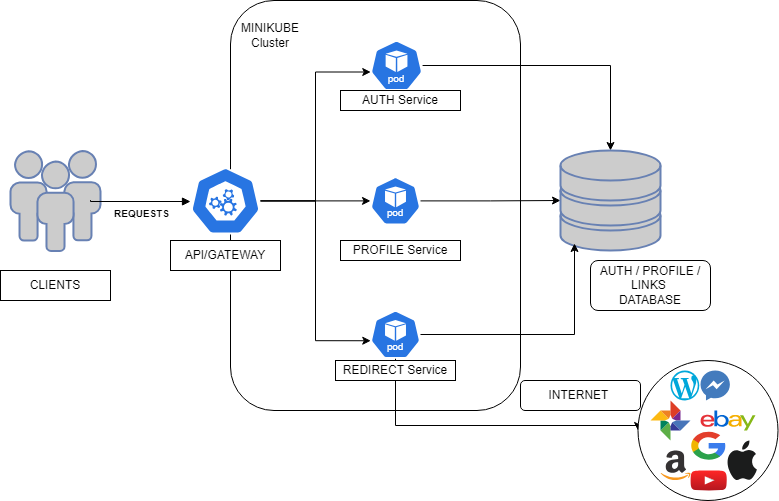

# URL-Shortener-Microservice
This is URL shortening microservice designed using python and flask and deployed using kubernetes on minikube cluster and Docker-compose.
This uses Postgresql Database of the host system.

## Screenshots

## Features

- Interactive UI
- User Friendly
- Scalable Service
- Secure Redirection
- Custom Shortening
- Cross platform 
- Detailed Reporting

## 🛠 Skills
Python, Flask, Bootstrap, Software design, Database design, Postgresql, Docker, Docker-Compose, Kubernetes, Minikube, Microservices Architecture.

## Feedback

If you have any feedback, please reach out to us at chaudharytushar014@gmail.com

